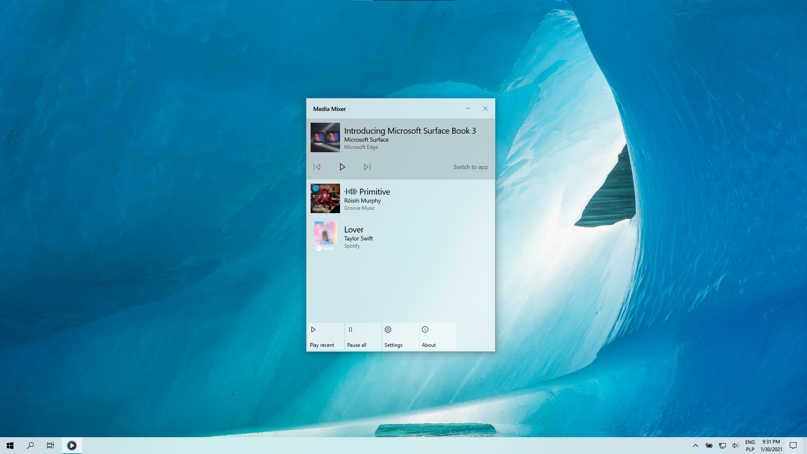

# Media Mixer

Welcome to the official issue-only repo for Media Mixer. Media Mixer is a desktop app that allows you to contol active media sessions in Windows 10 (e.g. Edge, Chrome, Spotify). It primarily uses WPF and UWP (as XAML Islands).

  

Feel free to share ideas about new features or report bugs.
